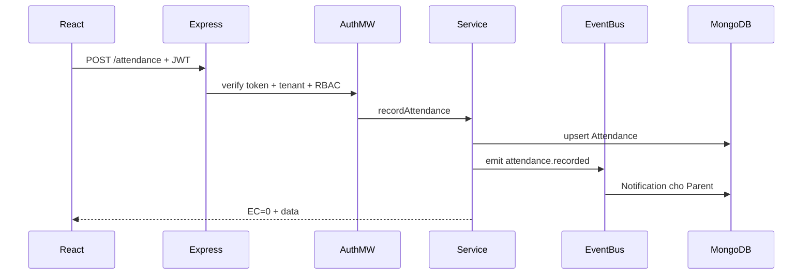

# EduMoet — Hệ thống Quản lý Trường học Đa trường (MERN)

> Đổi tên dự án: sửa `APP_NAME` trong `ExpressJS/.env` (một chỗ) — UI / tab / email / API tự theo.

MVP hoàn chỉnh: **multi-tenant** + **Design Patterns** + **Auth/RBAC 10 roles** + module cốt lõi + các module nâng cao (subscription, thi online, học liệu, thư viện, CSVC, audit, support, hạnh kiểm, mẫu dùng chung).

## Stack

| Tầng | Công nghệ |
|------|-----------|
| Frontend | React 18, Vite, Ant Design, Redux Toolkit, Axios, React Router |
| Backend | Node.js, Express.js, Mongoose |
| Database | MongoDB (shared DB + `schoolId`/`clusterId`) |
| Auth | JWT Bearer + RBAC theo role |

## Cấu trúc thư mục

```
code/
├── ExpressJS/                 # Backend API
│   └── src/
│       ├── config/            # DB Singleton
│       ├── constants/         # roles, permissions, status
│       ├── patterns/          # Repository, Strategy, Factory, Observer
│       ├── models/            # Mongoose schemas
│       ├── repositories/      # Data access layer
│       ├── services/          # Business logic
│       ├── controllers/
│       ├── middleware/        # Auth → Tenant → RBAC → Validate → Error
│       ├── routes/
│       ├── seed/              # seedDemo.js
│       └── server.js
├── ReactJS/                   # Frontend
│   └── src/
│       ├── api/
│       ├── components/        # layout, guards
│       ├── features/          # pages theo domain
│       ├── Redux/
│       ├── constants/
│       └── main.jsx
└── README.md
```

## Cài đặt & chạy từ đầu

### 1. Yêu cầu

- Node.js 18+
- MongoDB đang chạy (local `mongodb://localhost:27017`)

### 2. Backend

```bash
cd ExpressJS
npm install
```

Cấu hình [`ExpressJS/.env`](ExpressJS/.env):

```env
PORT=8080
MONGO_DB_URL=mongodb://localhost:27017/school_management
JWT_SECRET=school_mgmt_jwt_secret_change_me
JWT_EXPIRE=1d
```

Seed dữ liệu demo:

```bash
npm run seed
```

Chạy API:

```bash
npm run dev
```

API: `http://localhost:8080` — health: `GET /v1/api/health`

### 3. Frontend

```bash
cd ReactJS
npm install
```

[`ReactJS/.env.development`](ReactJS/.env.development):

```env
VITE_BACKEND_URL=http://localhost:8080
```

```bash
npm run dev
```

Mở URL Vite (thường `http://localhost:5173`), đăng nhập bằng tài khoản demo.

## Tài khoản demo

**Mật khẩu chung:** `Password@123`

| Email | Vai trò |
|-------|---------|
| `superadmin@system.vn` | Super Admin |
| `cluster@anhsang.edu.vn` | Quản lý cụm |
| `hieutruong@as1.edu.vn` | Hiệu trưởng (Cơ sở 1) |
| `giaovu@as1.edu.vn` | Giáo vụ |
| `gvtoan@as1.edu.vn` | GV bộ môn |
| `gvcn@as1.edu.vn` | GV chủ nhiệm |
| `ketoan@as1.edu.vn` | Kế toán |
| `thuthu@as1.edu.vn` | Thủ thư/CSVC |
| `hs1@as1.edu.vn` | Học sinh |
| `phuhuynh@as1.edu.vn` | Phụ huynh |
| `hieutruong@as2.edu.vn` | Hiệu trưởng (Cơ sở 2) |

## 10 Roles & phân quyền

`SUPER_ADMIN` → `CLUSTER_ADMIN` → `SCHOOL_ADMIN` → nhân sự trường / học sinh / phụ huynh.

- Super Admin: toàn hệ thống (không gắn `schoolId`)
- Cluster Admin: lọc theo `clusterId`
- Các role còn lại: lọc theo `schoolId` (tenant isolation)

Ma trận quyền: [`ExpressJS/src/constants/permissions.js`](ExpressJS/src/constants/permissions.js)

## Module cốt lõi (MVP)

| Module | API | Chức năng chính |
|--------|-----|-----------------|
| Auth | `/auth/google`, `/auth/config`, `/auth/me` | Đăng nhập **Gmail**, hồ sơ |
| Clusters/Schools | `/clusters`, `/schools` | Đa tenant / cụm |
| Users | `/users` | CRUD trong phạm vi |
| Academic | `/academic-years`, `/classes`, `/subjects`, `/assignments` | Cơ cấu tổ chức |
| Attendance | `/attendance` | Điểm danh + notify PH (Observer) |
| Grades | `/grades` | Nhập điểm + Strategy tính ĐTB |
| Fees | `/fees`, `/payments` | Hóa đơn & thu học phí |
| Announcements | `/announcements` | Thông báo đa phạm vi |
| Leave | `/leave-requests` | Xin nghỉ / duyệt |
| Timetable | `/timetables` | TKB + kiểm tra trùng GV |
| Dashboard | `/dashboard` | Factory theo role |
| Notifications | `/notifications` | Hộp thông báo |

## Xác thực Gmail (Google OAuth)

Hệ thống **ưu tiên đăng nhập bằng Gmail**. Không dùng SĐT / SMS / Zalo để xác thực.

### 1. Tạo Google OAuth Client

1. Vào [Google Cloud Console](https://console.cloud.google.com/) → APIs & Services → Credentials  
2. Create **OAuth client ID** loại **Web application**  
3. Authorized JavaScript origins: `http://localhost:5173`, `http://localhost:5174`, URL Cloudflare (nếu có)  
4. Copy **Client ID**

### 2. Cấu hình `.env`

**ExpressJS/.env**
```env
GOOGLE_CLIENT_ID=xxxxx.apps.googleusercontent.com
AUTH_GMAIL_ONLY=true
ALLOW_PASSWORD_LOGIN=false
GMAIL_USER=your@gmail.com
GMAIL_APP_PASSWORD=xxxx xxxx xxxx xxxx
```

**ReactJS/.env.development**
```env
VITE_GOOGLE_CLIENT_ID=xxxxx.apps.googleusercontent.com
```

- `AUTH_GMAIL_ONLY=true`: Google Sign-In chỉ nhận `@gmail.com` / `@googlemail.com`  
- `ALLOW_PASSWORD_LOGIN=false`: **chỉ Gmail** — không hiện / không chấp nhận mật khẩu  
- App Password: Google Account → Security → 2-Step Verification → App passwords (để gửi email thông báo)

### 3. Luồng đăng nhập Gmail

1. Admin tạo user với **đúng email Gmail** (`@gmail.com`) của người dùng  
2. Người dùng bấm **Sign in with Google**  
3. Backend verify ID token → khớp email trong DB → cấp JWT  

> Seed demo (`@as1.edu.vn`) chỉ dùng khi tạm bật `ALLOW_PASSWORD_LOGIN=true` để thử nội bộ. Production / bảo vệ luận văn: giữ `false` + tài khoản thật `@gmail.com`.

## Module mở rộng (đã hoàn thiện)

| Module | API / UI | Ai dùng chính |
|--------|----------|---------------|
| Gói dịch vụ | `/subscriptions`, `/subscription-invoices` · `/subscriptions` | Super Admin |
| Thi online | `/exams`, `/exam-attempts` · `/exams` | GV tạo/mở đề; HS làm bài (auto-chấm MCQ) |
| Học liệu | `/materials` · `/materials` | GV đăng; HS xem |
| Thư viện | `/library/books`, `/library/loans` · `/library` | Thủ thư mượn/trả; HS/PH xem |
| CSVC | `/facilities` · `/facilities` | GV đăng ký; Thủ thư/Giáo vụ duyệt |
| Nhật ký | `/audit-logs` · `/audit-logs` | Super Admin / Hiệu trưởng |
| Hỗ trợ KT | `/support-tickets` · `/support` | Trường tạo ticket; Super Admin xử lý |
| Hạnh kiểm | `/conduct` · `/conduct` | GVCN nhập; HS/PH xem |
| Mẫu dùng chung | `/templates` · `/templates` | Super Admin/Cụm tạo; áp dụng cho trường |
| Tin nhắn nội bộ | `/messages` · `/messages` | Trao đổi GV–PH–HS–BGH (+ email Gmail nếu cấu hình) |
| Lịch | `/calendar` · `/calendar` | Sự kiện, thi, nghỉ lễ, họp |
| Xuất Excel | `/export/grades|fees|attendance` | Báo cáo điểm / học phí / điểm danh |
| Import Excel | `/import/users|grades|fees|attendance` · UI trên các trang tương ứng | Import hàng loạt (+ tải file mẫu) |
| Tìm kiếm | `/search?q=` | Tìm user / lớp |

### Import Excel (cột mẫu)

| Loại | Cột chính |
|------|-----------|
| Người dùng | `email`, `name`, `role`, `code`, `phone`, `className` |
| Điểm | `studentCode`, `className`, `subjectCode`, `academicYear`, `semester`, `type`, `score`, `weight` |
| Học phí | `studentCode`, `academicYear`, `title`, `amount`, `dueDate`, `note` |
| Điểm danh | `date`, `period`, `className`, `studentCode`, `status`, `note` |

### Gợi ý thử nhanh sau seed

| Luồng | Đăng nhập | Việc làm |
|-------|-----------|----------|
| Gói dịch vụ | `superadmin@system.vn` | Xem subscriptions + hóa đơn gia hạn |
| Thi online | `hs1@as1.edu.vn` | Vào **Thi online** → Làm bài |
| Thư viện | `thuthu@as1.edu.vn` | Xem sách / phiếu mượn / trả sách |
| CSVC | `thuthu@as1.edu.vn` | Duyệt yêu cầu mượn máy chiếu |
| Hạnh kiểm | `gvcn@as1.edu.vn` | Xem/nhập xếp loại hạnh kiểm |
| Ticket | `hieutruong@as1.edu.vn` | Tạo ticket; Super Admin xử lý |

## Design Patterns (chi tiết)

### 1. Repository Pattern
- File: [`patterns/BaseRepository.js`](ExpressJS/src/patterns/BaseRepository.js), [`repositories/index.js`](ExpressJS/src/repositories/index.js)
- Service không gọi Mongoose trực tiếp cho CRUD chuẩn → dễ đổi nguồn dữ liệu / test.

### 2. Service Layer
- Thư mục `services/` chứa business rules (phạm vi tenant, validate nghiệp vụ, phát event).

### 3. Chain of Responsibility (Middleware)
Thứ tự trên mọi request API:

`authenticate` → `tenantContext` → `authorizeRoles/Permission` → `validate` → controller → `errorHandler`

### 4. Strategy Pattern
- File: [`patterns/gradeStrategy.js`](ExpressJS/src/patterns/gradeStrategy.js)
- `WeightedAverageStrategy` / `SimpleAverageStrategy` tính điểm trung bình & xếp loại khi nhập điểm.

### 5. Factory Pattern
- File: [`patterns/dashboardFactory.js`](ExpressJS/src/patterns/dashboardFactory.js)
- `DashboardFactory.create(role)` trả về builder dashboard phù hợp từng vai trò.

### 6. Observer Pattern
- File: [`patterns/eventBus.js`](ExpressJS/src/patterns/eventBus.js), [`patterns/registerListeners.js`](ExpressJS/src/patterns/registerListeners.js)
- Sự kiện: `attendance.recorded`, `announcement.created`, `leave.reviewed` → tạo `Notification`.

### 7. Singleton
- [`config/database.js`](ExpressJS/src/config/database.js) tái sử dụng kết nối Mongoose nếu đã connected.

### 8. Facade
- Seed (`seed/seedDemo.js`) và `dashboardService` gom nhiều thao tác/model thành một API đơn giản cho client.

## Luồng xử lý tiêu biểu



**Đăng nhập:** Login → JWT (payload: `_id, role, schoolId, clusterId`) → FE lưu token → mọi request kèm `Authorization: Bearer`.

**Nhập điểm:** Teacher POST scores → Strategy tính average/classification → lưu Grade.

**Đơn từ:** Parent/Student tạo leave → Homeroom/Academic/School Admin review → Observer gửi notification.

## Chuẩn response & lỗi

```json
{ "EC": 0, "EM": "Success", "data": {} }
```

- `EC !== 0`: lỗi nghiệp vụ / validation (422) / auth (401) / forbidden (403)
- Middleware `errorHandler` bắt `ApiError`, lỗi Mongoose validation, duplicate key (11000)

## Ghi chú phát triển tiếp

- Xác thực: **chỉ Gmail (Google OAuth)** — không SMS / Zalo / SĐT / mật khẩu (trừ khi bật `ALLOW_PASSWORD_LOGIN` cho demo)
- Chưa làm đầy đủ: payment gateway thật, backup/restore thật, chat realtime (Socket), SSO doanh nghiệp ngoài Google
- Nên đổi `JWT_SECRET` khi deploy; điền `GOOGLE_CLIENT_ID` + `GMAIL_APP_PASSWORD`
- Sau khi pull code mới: chạy lại `npm run seed` trong `ExpressJS`
